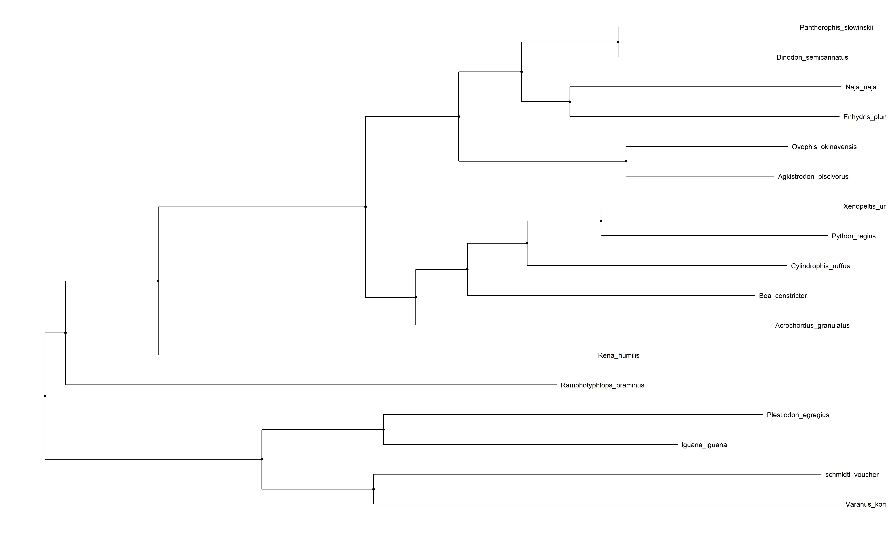
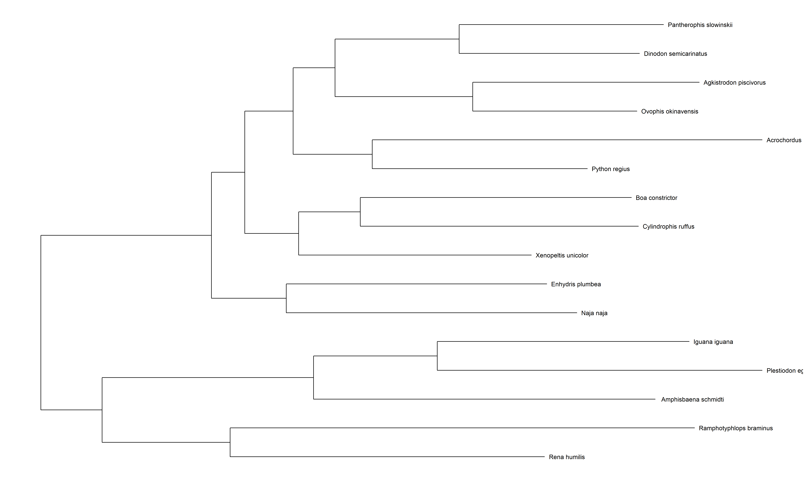

```{r setup, include=FALSE}
knitr::opts_chunk$set(echo = TRUE)
```

```{r include=FALSE}
library(ShortRead)
library(tidyverse)
library(stringr)
library(msa)
library(seqinr)
library(DNABarcodes)
library(GenomicRanges)
library(ggtree)
library(ape)
library(phangorn)
library(Biostrings)
library(BarcodingR)
library(GenomicAlignments)
library(geiger)
library(phylotools)

```

#Identifing Snakes Using Mitochondrial DNA


## Introduction
#### It can be hard to discover what types of snakes are found in a given area to test for biodiversity, and to identify unknown species. It is also hard to extract tissue or blood samples from snakes without harming them in order to do molecular analysis. Fortunately, there is a non-invasive method to get samples for molecular analysis by extracting mitochondrial DNA (mtDNA) from shedded snake skin. mtDNA is used instead of genomic DNA because only mtDNA is found in snake skin.  Cytochrome c oxidase subunit I (COI) is a well conserved gene and is frequently used for barcoding to help identify species. 


##Methods
#### Full mitochondrial and COI DNA sequences were gathered from NCBI for 14 snakes, and four lizards that were used as outgroups for phylogenetic analysis. I  wanted to see if this methodology worked for lizards as well. 

#### I first aligned the mitochondrial genomes using the ClustalW method to make a phylogenetic tree in order to test for relatedness with the msa package. I then used the phangorn and ape packages to build the maximum likelihood trees with 100 bootstraps. 
```{r echo=FALSE}
alignment = readRDS("./alignment.RDS")
print(alignment) 

```



#### Next I performed a local alignment for each COI gene with the full mitochondrial sequence separately for each species with the GenomicAlignments package. 
```{r echo=TRUE}
# an example with just one species.

agk = readDNAStringSet("./Project_Data/Agkistrodon_p_mt.fasta")
agkCOI = readDNAStringSet("./Project_Data/COI/COI_Agkistrodon_p.fasta")

agkaln = Biostrings::pairwiseAlignment(agkCOI, agk, type = "local")


```


#### From here I extracted the aligned part of the sequence and separated the views. Next I had to bind the extracted sequences. 
```{r echo=TRUE}
# an example with just one of the options

ext.agk = alignedPattern(agkaln)
view.agk = Views(agkaln, names = "agk")
print(ext.agk)
print(view.agk)
# after getting the extracted COI sequence I bound them all together with c()

```


#### I then separated the ranges from the views. 
```{r echo=TRUE}
# an example from one of the species 
agk.r = ranges(view.agk)
print(agk.r)
# I bound them all together with c()
```


##Results
#### From the extracted sequences, I aligned the COI sequences and then made another tree with the default settings and 100 bootstraps.
#### I also viewed all the ranges and compared them so you can see that the ranges are different.
```{r echo=FALSE}
ranges.COI = readRDS("./ranges_COI.RDS")
options(showTailLines=Inf)
print(ranges.COI)
```



##Conclusion
#### By doing a local alignment with just the COI genes with a reference mtDNA sequence from NCBI and by extracting the ranges, you should be able to identify an unknown snake or lizard from mtDNA extracted from their shedded skin.


##References
###Yan, Jie et al. “Evolution of the mitochondrial genome in snakes: gene rearrangements and phylogenetic relationships.” BMC genomics vol. 9 569. 28 Nov. 2008, doi:10.1186/1471-2164-9-569


